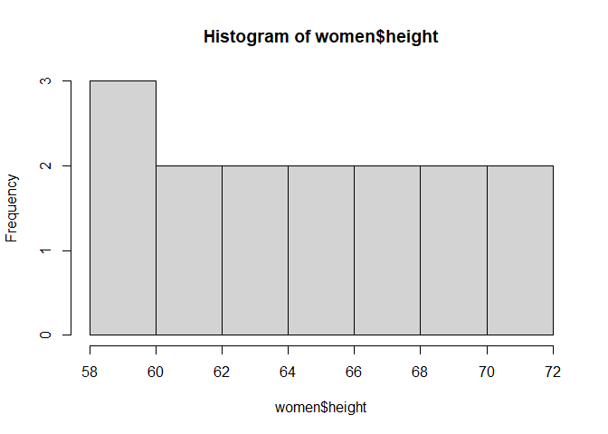

# My Analysis


- [Quarto](#quarto)
- [Running Code](#running-code)

## Quarto

Quarto enables you to weave together content and executable code into a
finished document.

## Running Code

When you click the **Render** button a document will be generated that
includes both content and the output of embedded code. You can embed
code like this:

``` r
women
```

       height weight
    1      58    115
    2      59    117
    3      60    120
    4      61    123
    5      62    126
    6      63    129
    7      64    132
    8      65    135
    9      66    139
    10     67    142
    11     68    146
    12     69    150
    13     70    154
    14     71    159
    15     72    164

You can add options to executable code like this

``` r
str(women)
```

    'data.frame':   15 obs. of  2 variables:
     $ height: num  58 59 60 61 62 63 64 65 66 67 ...
     $ weight: num  115 117 120 123 126 129 132 135 139 142 ...

some Analysis of Women data.

``` r
cor(women$height,women$weight)
```

    [1] 0.9954948

``` r
plot(hist(women$height))
```



I also would wish to add model.

``` r
library(tidyverse)
```

    ── Attaching core tidyverse packages ──────────────────────── tidyverse 2.0.0 ──
    ✔ dplyr     1.1.4     ✔ readr     2.1.5
    ✔ forcats   1.0.0     ✔ stringr   1.5.1
    ✔ ggplot2   4.0.2     ✔ tibble    3.2.1
    ✔ lubridate 1.9.4     ✔ tidyr     1.3.1
    ✔ purrr     1.0.4     
    ── Conflicts ────────────────────────────────────────── tidyverse_conflicts() ──
    ✖ dplyr::filter() masks stats::filter()
    ✖ dplyr::lag()    masks stats::lag()
    ℹ Use the conflicted package (<http://conflicted.r-lib.org/>) to force all conflicts to become errors

``` r
women %>% 
  ggplot(aes(x=height, y=weight))+
  geom_smooth(method ="lm", se =TRUE)
```

    `geom_smooth()` using formula = 'y ~ x'


``` r
women %>% 
  lm(women$height ~ women$weight, data =.) %>% 
  summary()
```


    Call:
    lm(formula = women$height ~ women$weight, data = .)

    Residuals:
         Min       1Q   Median       3Q      Max 
    -0.83233 -0.26249  0.08314  0.34353  0.49790 

    Coefficients:
                  Estimate Std. Error t value Pr(>|t|)    
    (Intercept)  25.723456   1.043746   24.64 2.68e-12 ***
    women$weight  0.287249   0.007588   37.85 1.09e-14 ***
    ---
    Signif. codes:  0 '***' 0.001 '**' 0.01 '*' 0.05 '.' 0.1 ' ' 1

    Residual standard error: 0.44 on 13 degrees of freedom
    Multiple R-squared:  0.991, Adjusted R-squared:  0.9903 
    F-statistic:  1433 on 1 and 13 DF,  p-value: 1.091e-14

``` r
cor.test(women$height, women$weight)
```


        Pearson's product-moment correlation

    data:  women$height and women$weight
    t = 37.855, df = 13, p-value = 1.091e-14
    alternative hypothesis: true correlation is not equal to 0
    95 percent confidence interval:
     0.9860970 0.9985447
    sample estimates:
          cor 
    0.9954948 
