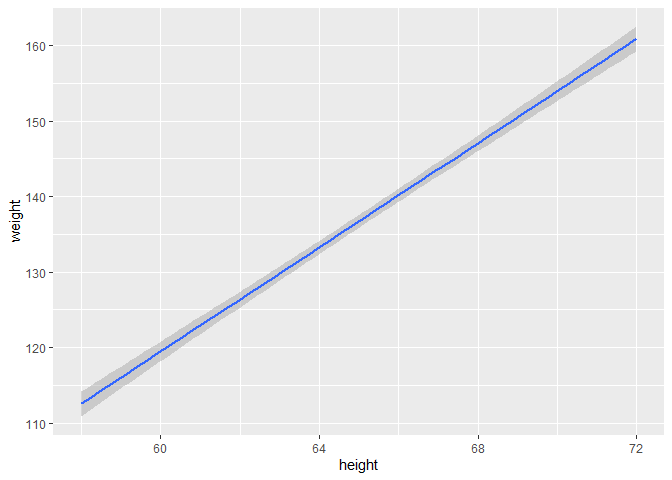
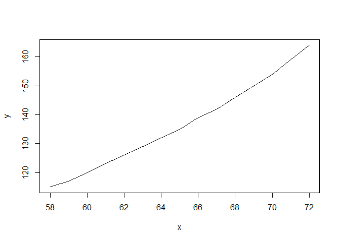
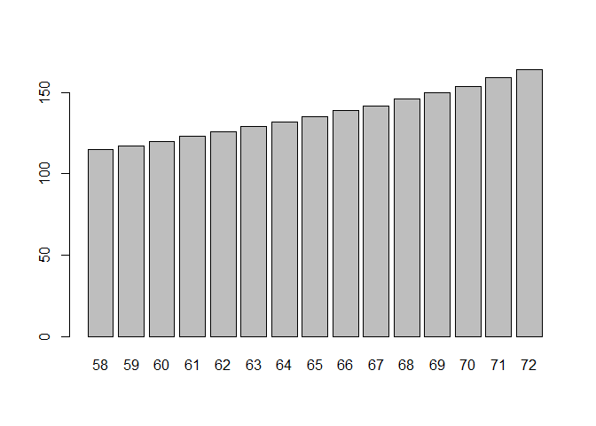
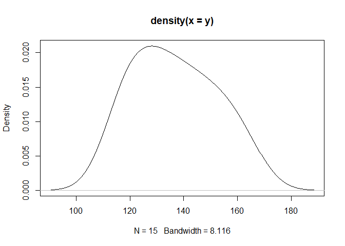
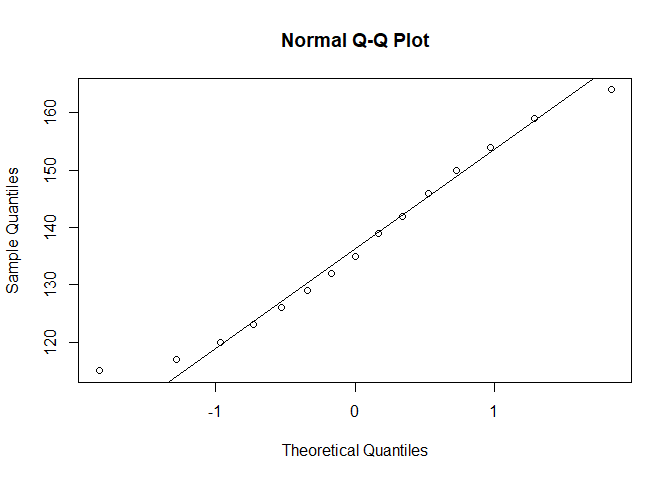
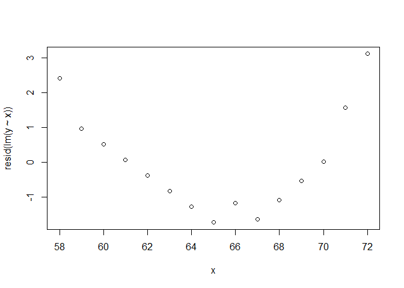
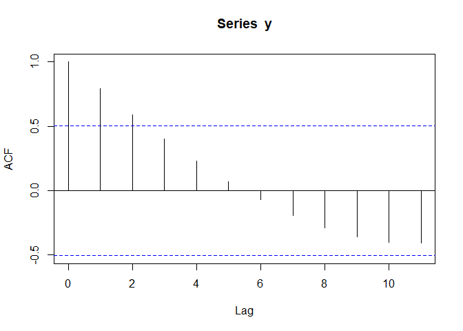

# My Analysis


- [START](#start)
- [Descriptive Statistics.](#descriptive-statistics)
- [](#section)
- [Predictions](#predictions)
- [Hypothesis Tests](#hypothesis-tests)

## START

This is the beginning of descriptive analysis of the women dataset that
is available in R, it shall form part of a journey of a thousand miles:

``` r
women
```

       height weight
    1      58    115
    2      59    117
    3      60    120
    4      61    123
    5      62    126
    6      63    129
    7      64    132
    8      65    135
    9      66    139
    10     67    142
    11     68    146
    12     69    150
    13     70    154
    14     71    159
    15     72    164

You can add options to executable code like this

``` r
str(women)
```

    'data.frame':   15 obs. of  2 variables:
     $ height: num  58 59 60 61 62 63 64 65 66 67 ...
     $ weight: num  115 117 120 123 126 129 132 135 139 142 ...

# Descriptive Statistics.

# 

``` r
df <- data.frame(
  age = 58:72,
  height = c(115, 117, 120, 123, 126, 129, 132, 135, 
            139, 142, 146, 150, 154, 159, 164)
  )
df
```

       age height
    1   58    115
    2   59    117
    3   60    120
    4   61    123
    5   62    126
    6   63    129
    7   64    132
    8   65    135
    9   66    139
    10  67    142
    11  68    146
    12  69    150
    13  70    154
    14  71    159
    15  72    164

``` r
x <- women$height
y <- women$weight
```

``` r
plot(x,y)
```



``` r
plot(x, y, type ='l')
```



Barchart

``` r
barplot(y, names.arg = x)
```



Density plot

``` r
plot(density(y))
```



Q-Q plot

``` r
qqnorm(y); qqline(y)
```



Residuals

``` r
plot(x, resid(lm(y ~ x)))
```



ACF plot

``` r
acf(y)
```



# Predictions

linear

``` r
predict(lm(y ~x), data.frame(x =73))
```

           1 
    164.3333 

``` r
predict(lm(y ~poly(x,2)), data.frame(x=73))
```

           1 
    168.0989 

``` r
#quad pred
```

Linear Interpolation

``` r
approx(x, y, xout = 73)$y
```

    [1] NA

Spline Interplolation

``` r
spline(x, y, xout = 73)$y
```

    [1] 167.8803

LOESS

``` r
#loess(y ~ x) %>% 
 # predict(data.frame(x=73))
```

``` r
library(randomForest)
```

    randomForest 4.7-1.2

    Type rfNews() to see new features/changes/bug fixes.

``` r
predict(randomForest(y ~x, ntree =50), data.frame(x =73))
```

          1 
    157.123 

``` r
t.test(y, mu =140)
```


        One Sample t-test

    data:  y
    t = -0.81631, df = 14, p-value = 0.428
    alternative hypothesis: true mean is not equal to 140
    95 percent confidence interval:
     128.1504 145.3162
    sample estimates:
    mean of x 
     136.7333 

``` r
mean(y)
```

    [1] 136.7333

# Hypothesis Tests

``` r
t.test(y[1:7], y[8:15])
```


        Welch Two Sample t-test

    data:  y[1:7] and y[8:15]
    t = -5.9795, df = 11.872, p-value = 6.706e-05
    alternative hypothesis: true difference in means is not equal to 0
    95 percent confidence interval:
     -34.77840 -16.18588
    sample estimates:
    mean of x mean of y 
     123.1429  148.6250 

Test Equal Variances

``` r
var.test(y[1:7], y[8:15])
```


        F test to compare two variances

    data:  y[1:7] and y[8:15]
    F = 0.38927, num df = 6, denom df = 7, p-value = 0.2708
    alternative hypothesis: true ratio of variances is not equal to 1
    95 percent confidence interval:
     0.07605086 2.21709666
    sample estimates:
    ratio of variances 
             0.3892737 

Wilcoxon For Non-Parametric

``` r
wilcox.test(y[1:7], y[8:15])
```


        Wilcoxon rank sum exact test

    data:  y[1:7] and y[8:15]
    W = 0, p-value = 0.0003108
    alternative hypothesis: true location shift is not equal to 0

Normality Test

``` r
shapiro.test(y)
```


        Shapiro-Wilk normality test

    data:  y
    W = 0.96036, p-value = 0.6986

Distribution Test

``` r
ks.test(y,"pnorm", mean(y), sd(y))
```


        Exact one-sample Kolmogorov-Smirnov test

    data:  y
    D = 0.091099, p-value = 0.9984
    alternative hypothesis: two-sided

Chi-square Goodness of Fit

``` r
chisq.test(table(cut(y,3)))
```


        Chi-squared test for given probabilities

    data:  table(cut(y, 3))
    X-squared = 0.4, df = 2, p-value = 0.8187

``` r
library(dplyr)
```


    Attaching package: 'dplyr'

    The following object is masked from 'package:randomForest':

        combine

    The following objects are masked from 'package:stats':

        filter, lag

    The following objects are masked from 'package:base':

        intersect, setdiff, setequal, union

``` r
women %>% 
  lm(x ~ y, data =.) %>% 
  summary()
```


    Call:
    lm(formula = x ~ y, data = .)

    Residuals:
         Min       1Q   Median       3Q      Max 
    -0.83233 -0.26249  0.08314  0.34353  0.49790 

    Coefficients:
                 Estimate Std. Error t value Pr(>|t|)    
    (Intercept) 25.723456   1.043746   24.64 2.68e-12 ***
    y            0.287249   0.007588   37.85 1.09e-14 ***
    ---
    Signif. codes:  0 '***' 0.001 '**' 0.01 '*' 0.05 '.' 0.1 ' ' 1

    Residual standard error: 0.44 on 13 degrees of freedom
    Multiple R-squared:  0.991, Adjusted R-squared:  0.9903 
    F-statistic:  1433 on 1 and 13 DF,  p-value: 1.091e-14

F-Test For regression

``` r
summary(lm(x ~ y))$fstatistic
```

       value    numdf    dendf 
    1433.024    1.000   13.000 

Durbin-Watson Test

``` r
library(lmtest)
```

    Loading required package: zoo


    Attaching package: 'zoo'

    The following objects are masked from 'package:base':

        as.Date, as.Date.numeric

``` r
dwtest(lm(x ~y))
```


        Durbin-Watson test

    data:  lm(x ~ y)
    DW = 0.31156, p-value = 9.623e-08
    alternative hypothesis: true autocorrelation is greater than 0
