# AI and the Global Workforce


- [The Future of Work in the Age of AI: A Comprehensive Analysis of Job
  Displacement, Reskilling Needs, and Salary Trends Across 8 Countries
  and 12 Industries
  (2020-2026).](#the-future-of-work-in-the-age-of-ai-a-comprehensive-analysis-of-job-displacement-reskilling-needs-and-salary-trends-across-8-countries-and-12-industries-2020-2026)
  - [**Descriptive Analysis with
    Visualizations**](#descriptive-analysis-with-visualizations)
  - [Automation Risk by Industry](#automation-risk-by-industry)
  - [AI Adoption Vs Job Replacements](#ai-adoption-vs-job-replacements)
  - [Correlation Analysis](#correlation-analysis)
  - [Regression Analysis](#regression-analysis)
  - [Salary Impact Analysis](#salary-impact-analysis)
  - [Time Trend(2020-2026)](#time-trend2020-2026)
  - [Reskilling Needs](#reskilling-needs)
  - [**Simple Predictive Models**](#simple-predictive-models)
  - [**Advanced Analysis**](#advanced-analysis)

# The Future of Work in the Age of AI: A Comprehensive Analysis of Job Displacement, Reskilling Needs, and Salary Trends Across 8 Countries and 12 Industries (2020-2026).

``` r
library(readr)
ai_job_replacement_2020_2026_v2 <- read_csv("D:/Desktop/ai_job_replacement_2020_2026_v2.csv")
```

    Rows: 15000 Columns: 14
    ── Column specification ────────────────────────────────────────────────────────
    Delimiter: ","
    chr  (3): job_role, industry, country
    dbl (11): year, automation_risk_percent, ai_replacement_score, skill_gap_ind...

    ℹ Use `spec()` to retrieve the full column specification for this data.
    ℹ Specify the column types or set `show_col_types = FALSE` to quiet this message.

``` r
str(ai_job_replacement_2020_2026_v2)
```

    spc_tbl_ [15,000 × 14] (S3: spec_tbl_df/tbl_df/tbl/data.frame)
     $ job_role                   : chr [1:15000] "Data Analyst" "Accountant" "Teacher" "Customer Support Rep" ...
     $ industry                   : chr [1:15000] "Technology" "Finance" "Technology" "Technology" ...
     $ country                    : chr [1:15000] "Canada" "Brazil" "USA" "Brazil" ...
     $ year                       : num [1:15000] 2021 2020 2020 2021 2024 ...
     $ automation_risk_percent    : num [1:15000] 26.2 52.1 31.3 56.9 14.6 ...
     $ ai_replacement_score       : num [1:15000] 30.9 56.4 31.6 63.4 17.2 ...
     $ skill_gap_index            : num [1:15000] 73.2 2.06 43.19 19.97 96.56 ...
     $ salary_before_usd          : num [1:15000] 101839 146389 64948 91708 127008 ...
     $ salary_change_percent      : num [1:15000] -2.34 -4.69 -10.13 -5.44 -6.01 ...
     $ skill_demand_growth_percent: num [1:15000] 2.66 10.43 8.14 6.11 2.08 ...
     $ remote_feasibility_score   : num [1:15000] 15.2 26.4 36.3 64.7 71.6 ...
     $ ai_adoption_level          : num [1:15000] 86.6 18.3 36.6 17.1 44 ...
     $ education_requirement_level: num [1:15000] 2 5 2 5 3 3 1 3 4 5 ...
     $ reskilling_urgency_score   : num [1:15000] 33.1 22.9 28.5 30.4 36.6 ...
     - attr(*, "spec")=
      .. cols(
      ..   job_role = col_character(),
      ..   industry = col_character(),
      ..   country = col_character(),
      ..   year = col_double(),
      ..   automation_risk_percent = col_double(),
      ..   ai_replacement_score = col_double(),
      ..   skill_gap_index = col_double(),
      ..   salary_before_usd = col_double(),
      ..   salary_change_percent = col_double(),
      ..   skill_demand_growth_percent = col_double(),
      ..   remote_feasibility_score = col_double(),
      ..   ai_adoption_level = col_double(),
      ..   education_requirement_level = col_double(),
      ..   reskilling_urgency_score = col_double()
      .. )
     - attr(*, "problems")=<externalptr> 

`{View(ai_job_replacement_2020_2026_v2)}`

``` r
colSums(is.na(ai_job_replacement_2020_2026_v2))
```

                       job_role                    industry 
                              0                           0 
                        country                        year 
                              0                           0 
        automation_risk_percent        ai_replacement_score 
                              0                           0 
                skill_gap_index           salary_before_usd 
                              0                           0 
          salary_change_percent skill_demand_growth_percent 
                              0                           0 
       remote_feasibility_score           ai_adoption_level 
                              0                           0 
    education_requirement_level    reskilling_urgency_score 
                              0                           0 

``` r
names(ai_job_replacement_2020_2026_v2)
```

     [1] "job_role"                    "industry"                   
     [3] "country"                     "year"                       
     [5] "automation_risk_percent"     "ai_replacement_score"       
     [7] "skill_gap_index"             "salary_before_usd"          
     [9] "salary_change_percent"       "skill_demand_growth_percent"
    [11] "remote_feasibility_score"    "ai_adoption_level"          
    [13] "education_requirement_level" "reskilling_urgency_score"   

**Loading Required Packages**

Packages help with:

- data manipulation

- visualization

- statistical analysis

``` r
#install.packages(c("tidyverse", "skimr", "GGally", "corrplot"))

# Load packages
library(tidyverse)
```

    ── Attaching core tidyverse packages ──────────────────────── tidyverse 2.0.0 ──
    ✔ dplyr     1.1.4     ✔ purrr     1.0.4
    ✔ forcats   1.0.0     ✔ stringr   1.5.1
    ✔ ggplot2   4.0.2     ✔ tibble    3.2.1
    ✔ lubridate 1.9.4     ✔ tidyr     1.3.1
    ── Conflicts ────────────────────────────────────────── tidyverse_conflicts() ──
    ✖ dplyr::filter() masks stats::filter()
    ✖ dplyr::lag()    masks stats::lag()
    ℹ Use the conflicted package (<http://conflicted.r-lib.org/>) to force all conflicts to become errors

``` r
library(skimr)
library(GGally)
library(corrplot)
```

    corrplot 0.95 loaded

**Renaming my dataset.**

``` r
df <-ai_job_replacement_2020_2026_v2
df
```

    # A tibble: 15,000 × 14
       job_role   industry country  year automation_risk_perc…¹ ai_replacement_score
       <chr>      <chr>    <chr>   <dbl>                  <dbl>                <dbl>
     1 Data Anal… Technol… Canada   2021                  26.2                 30.9 
     2 Accountant Finance  Brazil   2020                  52.1                 56.4 
     3 Teacher    Technol… USA      2020                  31.3                 31.6 
     4 Customer … Technol… Brazil   2021                  56.9                 63.4 
     5 Teacher    Manufac… Japan    2024                  14.6                 17.2 
     6 Software … Healthc… Singap…  2022                   8.54                 8.53
     7 Accountant Manufac… Austra…  2020                  48.3                 42.2 
     8 Teacher    Finance  Austra…  2026                  13.2                 12.2 
     9 Marketing… Retail   USA      2025                  19.9                 22.3 
    10 Financial… Finance  Singap…  2020                  59.5                 64.9 
    # ℹ 14,990 more rows
    # ℹ abbreviated name: ¹​automation_risk_percent
    # ℹ 8 more variables: skill_gap_index <dbl>, salary_before_usd <dbl>,
    #   salary_change_percent <dbl>, skill_demand_growth_percent <dbl>,
    #   remote_feasibility_score <dbl>, ai_adoption_level <dbl>,
    #   education_requirement_level <dbl>, reskilling_urgency_score <dbl>

``` r
head(df)
```

    # A tibble: 6 × 14
      job_role    industry country  year automation_risk_perc…¹ ai_replacement_score
      <chr>       <chr>    <chr>   <dbl>                  <dbl>                <dbl>
    1 Data Analy… Technol… Canada   2021                  26.2                 30.9 
    2 Accountant  Finance  Brazil   2020                  52.1                 56.4 
    3 Teacher     Technol… USA      2020                  31.3                 31.6 
    4 Customer S… Technol… Brazil   2021                  56.9                 63.4 
    5 Teacher     Manufac… Japan    2024                  14.6                 17.2 
    6 Software E… Healthc… Singap…  2022                   8.54                 8.53
    # ℹ abbreviated name: ¹​automation_risk_percent
    # ℹ 8 more variables: skill_gap_index <dbl>, salary_before_usd <dbl>,
    #   salary_change_percent <dbl>, skill_demand_growth_percent <dbl>,
    #   remote_feasibility_score <dbl>, ai_adoption_level <dbl>,
    #   education_requirement_level <dbl>, reskilling_urgency_score <dbl>

``` r
summary(df)
```

       job_role           industry           country               year     
     Length:15000       Length:15000       Length:15000       Min.   :2020  
     Class :character   Class :character   Class :character   1st Qu.:2021  
     Mode  :character   Mode  :character   Mode  :character   Median :2023  
                                                              Mean   :2023  
                                                              3rd Qu.:2025  
                                                              Max.   :2026  
     automation_risk_percent ai_replacement_score skill_gap_index salary_before_usd
     Min.   : 5.00           Min.   :  4.01       Min.   : 0.00   Min.   : 30004   
     1st Qu.:28.79           1st Qu.: 28.36       1st Qu.:25.17   1st Qu.: 60127   
     Median :46.23           Median : 45.67       Median :49.93   Median : 89533   
     Mean   :46.18           Mean   : 46.16       Mean   :50.00   Mean   : 89771   
     3rd Qu.:63.60           3rd Qu.: 62.71       3rd Qu.:75.03   3rd Qu.:119824   
     Max.   :94.98           Max.   :113.07       Max.   :99.98   Max.   :149984   
     salary_change_percent skill_demand_growth_percent remote_feasibility_score
     Min.   :-38.3700      Min.   :-31.880             Min.   :10.01           
     1st Qu.: -6.6400      1st Qu.: -1.663             1st Qu.:32.52           
     Median :  0.1500      Median :  4.960             Median :54.77           
     Mean   :  0.1143      Mean   :  5.020             Mean   :54.90           
     3rd Qu.:  6.6900      3rd Qu.: 11.730             3rd Qu.:77.41           
     Max.   : 36.9200      Max.   : 49.790             Max.   :99.99           
     ai_adoption_level education_requirement_level reskilling_urgency_score
     Min.   : 0.01     Min.   :1.000               Min.   : 2.456          
     1st Qu.:24.71     1st Qu.:2.000               1st Qu.:26.982          
     Median :49.44     Median :3.000               Median :35.871          
     Mean   :49.80     Mean   :3.015               Mean   :35.868          
     3rd Qu.:74.80     3rd Qu.:4.000               3rd Qu.:44.699          
     Max.   :99.98     Max.   :5.000               Max.   :71.579          

**This shows:**

- minimum

- maximum

- mean

- quartiles

  The average automation risk is about **52%**

``` {skim(df)}
```

This gives:

- Missing values

- mean

- standard deviation

- Distributions

``` r
colSums(is.na(df))
```

                       job_role                    industry 
                              0                           0 
                        country                        year 
                              0                           0 
        automation_risk_percent        ai_replacement_score 
                              0                           0 
                skill_gap_index           salary_before_usd 
                              0                           0 
          salary_change_percent skill_demand_growth_percent 
                              0                           0 
       remote_feasibility_score           ai_adoption_level 
                              0                           0 
    education_requirement_level    reskilling_urgency_score 
                              0                           0 

Check for missing values

``` r
library(tidyverse)
```

Convert categorical variables to factors

``` r
df$job_role <- as.factor(df$job_role)
df$industry <- as.factor(df$industry)
df$country <- as.factor(df$country)
df$education_requirement_level <- as.factor(df$education_requirement_level)
```

Check factor levels

``` r
levels(df$job_role)[1:20]
```

     [1] "Accountant"           "Customer Support Rep" "Data Analyst"        
     [4] "Financial Analyst"    "HR Manager"           "Marketing Specialist"
     [7] "Mechanical Engineer"  "Software Engineer"    "Teacher"             
    [10] "Truck Driver"         NA                     NA                    
    [13] NA                     NA                     NA                    
    [16] NA                     NA                     NA                    
    [19] NA                     NA                    

``` r
levels(df$industry)
```

    [1] "Education"      "Energy"         "Finance"        "Healthcare"    
    [5] "Manufacturing"  "Retail"         "Technology"     "Transportation"

``` r
levels(df$country)
```

    [1] "Australia" "Brazil"    "Canada"    "Germany"   "India"     "Japan"    
    [7] "Singapore" "UK"        "USA"      

``` r
levels(df$education_requirement_level)
```

    [1] "1" "2" "3" "4" "5"

``` r
str(df)
```

    spc_tbl_ [15,000 × 14] (S3: spec_tbl_df/tbl_df/tbl/data.frame)
     $ job_role                   : Factor w/ 10 levels "Accountant","Customer Support Rep",..: 3 1 9 2 9 8 1 9 6 4 ...
     $ industry                   : Factor w/ 8 levels "Education","Energy",..: 7 3 7 7 5 4 5 3 6 3 ...
     $ country                    : Factor w/ 9 levels "Australia","Brazil",..: 3 2 9 2 6 7 1 1 9 7 ...
     $ year                       : num [1:15000] 2021 2020 2020 2021 2024 ...
     $ automation_risk_percent    : num [1:15000] 26.2 52.1 31.3 56.9 14.6 ...
     $ ai_replacement_score       : num [1:15000] 30.9 56.4 31.6 63.4 17.2 ...
     $ skill_gap_index            : num [1:15000] 73.2 2.06 43.19 19.97 96.56 ...
     $ salary_before_usd          : num [1:15000] 101839 146389 64948 91708 127008 ...
     $ salary_change_percent      : num [1:15000] -2.34 -4.69 -10.13 -5.44 -6.01 ...
     $ skill_demand_growth_percent: num [1:15000] 2.66 10.43 8.14 6.11 2.08 ...
     $ remote_feasibility_score   : num [1:15000] 15.2 26.4 36.3 64.7 71.6 ...
     $ ai_adoption_level          : num [1:15000] 86.6 18.3 36.6 17.1 44 ...
     $ education_requirement_level: Factor w/ 5 levels "1","2","3","4",..: 2 5 2 5 3 3 1 3 4 5 ...
     $ reskilling_urgency_score   : num [1:15000] 33.1 22.9 28.5 30.4 36.6 ...
     - attr(*, "spec")=
      .. cols(
      ..   job_role = col_character(),
      ..   industry = col_character(),
      ..   country = col_character(),
      ..   year = col_double(),
      ..   automation_risk_percent = col_double(),
      ..   ai_replacement_score = col_double(),
      ..   skill_gap_index = col_double(),
      ..   salary_before_usd = col_double(),
      ..   salary_change_percent = col_double(),
      ..   skill_demand_growth_percent = col_double(),
      ..   remote_feasibility_score = col_double(),
      ..   ai_adoption_level = col_double(),
      ..   education_requirement_level = col_double(),
      ..   reskilling_urgency_score = col_double()
      .. )
     - attr(*, "problems")=<externalptr> 

``` r
# 7. Create derived columns
df <- df %>%
  mutate(
    # Year categories
    year_category = case_when(
      year <= 2022 ~ "Past",
      year <= 2024 ~ "Present",
      TRUE ~ "Future"
    ),
    # Risk brackets
    risk_bracket = case_when(
      automation_risk_percent < 33 ~ "Low Risk",
      automation_risk_percent < 67 ~ "Medium Risk",
      TRUE ~ "High Risk"
    )
  )
```

Make them factors

``` r
df$year_category <- factor(df$year_category, levels = c("Past", "Present", "Future"))
df$risk_bracket <- factor(df$risk_bracket, levels = c("Low Risk", "Medium Risk", "High Risk"))
```

Quick summary of numerical columns

``` r
df %>%
  select(where(is.numeric)) %>%
  summary()
```

          year      automation_risk_percent ai_replacement_score skill_gap_index
     Min.   :2020   Min.   : 5.00           Min.   :  4.01       Min.   : 0.00  
     1st Qu.:2021   1st Qu.:28.79           1st Qu.: 28.36       1st Qu.:25.17  
     Median :2023   Median :46.23           Median : 45.67       Median :49.93  
     Mean   :2023   Mean   :46.18           Mean   : 46.16       Mean   :50.00  
     3rd Qu.:2025   3rd Qu.:63.60           3rd Qu.: 62.71       3rd Qu.:75.03  
     Max.   :2026   Max.   :94.98           Max.   :113.07       Max.   :99.98  
     salary_before_usd salary_change_percent skill_demand_growth_percent
     Min.   : 30004    Min.   :-38.3700      Min.   :-31.880            
     1st Qu.: 60127    1st Qu.: -6.6400      1st Qu.: -1.663            
     Median : 89533    Median :  0.1500      Median :  4.960            
     Mean   : 89771    Mean   :  0.1143      Mean   :  5.020            
     3rd Qu.:119824    3rd Qu.:  6.6900      3rd Qu.: 11.730            
     Max.   :149984    Max.   : 36.9200      Max.   : 49.790            
     remote_feasibility_score ai_adoption_level reskilling_urgency_score
     Min.   :10.01            Min.   : 0.01     Min.   : 2.456          
     1st Qu.:32.52            1st Qu.:24.71     1st Qu.:26.982          
     Median :54.77            Median :49.44     Median :35.871          
     Mean   :54.90            Mean   :49.80     Mean   :35.868          
     3rd Qu.:77.41            3rd Qu.:74.80     3rd Qu.:44.699          
     Max.   :99.99            Max.   :99.98     Max.   :71.579          

``` r
# 10. Save cleaned data
write.csv(df, "ai_job_replacement_cleaned.csv", row.names = FALSE)
```

Compute:

- mean automation risk

- average AI replacement score

- Average salary before AI

``` r
mean(df$automation_risk_percent)
```

    [1] 46.17635

``` r
mean(df$ai_replacement_score)
```

    [1] 46.15591

``` r
mean(df$salary_before_usd)
```

    [1] 89771.38

## **Descriptive Analysis with Visualizations**

``` r
# Load visualization libraries
library(ggplot2)
library(viridis)
```

    Loading required package: viridisLite

``` r
library(gridExtra)
```


    Attaching package: 'gridExtra'

    The following object is masked from 'package:dplyr':

        combine

**Distribution of Automation Risk**

``` r
ggplot(df, aes(x = automation_risk_percent)) +
  geom_histogram(bins = 30, fill = "steelblue") +
  labs(title = "Distribution of Automation Risk",
       x = "Automation Risk (%)",
       y = "Frequency")
```

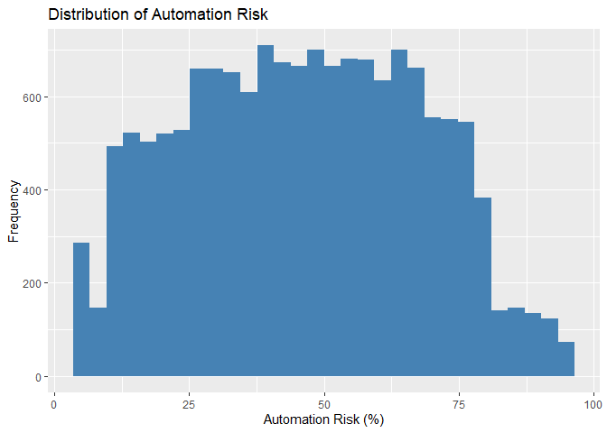

This shows how automation risk is distributed across jobs

- Right skewed \$\rightarrow\$ most jobs at risk

- Left skewed -\> most jobs high risk

## Automation Risk by Industry

**Which industries are at most risk?**

``` r
df %>%
  group_by(industry) %>%
  summarise(mean_risk = mean(automation_risk_percent)) %>%
  arrange(desc(mean_risk))
```

    # A tibble: 8 × 2
      industry       mean_risk
      <fct>              <dbl>
    1 Energy              47.0
    2 Manufacturing       46.9
    3 Finance             46.4
    4 Retail              46.1
    5 Transportation      45.9
    6 Healthcare          45.8
    7 Technology          45.7
    8 Education           45.6

``` r
ggplot(df, aes(industry, automation_risk_percent)) +
  geom_boxplot(fill = "orange") +
  theme(axis.text.x = element_text(angle = 45, hjust = 1)) +
  labs(title = "Automation Risk by Industry")
```

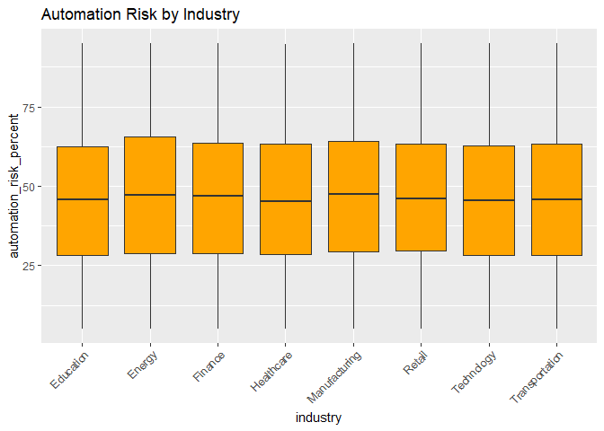

Industries with **higher medians are more vulnerable to AI automation**.

## AI Adoption Vs Job Replacements

*Objective*

**Does higher AI adoption increase job replacement?**

*Scatter Plot*

``` r
ggplot(df, aes(ai_adoption_level, ai_replacement_score)) +
  geom_point(alpha = 0.4) +
  geom_smooth(method = "lm", color = "red") +
  labs(title = "AI Adoption vs Job Replacement",
       x = "AI Adoption Level",
       y = "AI Replacement Score")
```

    `geom_smooth()` using formula = 'y ~ x'

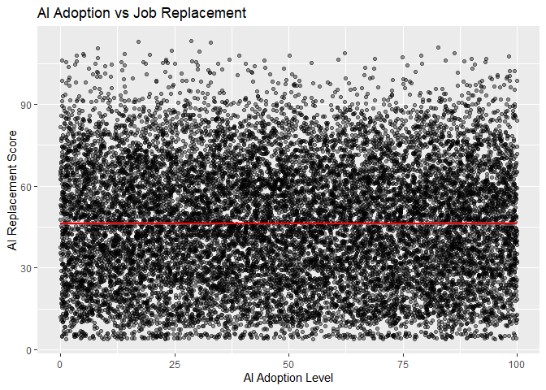

If the red line slopes upward → **higher AI adoption increases job
replacement risk**.

Currently, the red line does not slope upwards, therefore, they are not
directly proportional.

## Correlation Analysis

*Checking relationships between numeric variables*

``` r
numeric_data <- df %>%
  select(where(is.numeric))
cor_matrix <- cor(numeric_data)

cor_matrix
```

                                         year automation_risk_percent
    year                         1.0000000000            -0.003177902
    automation_risk_percent     -0.0031779020             1.000000000
    ai_replacement_score        -0.0018649175             0.964406914
    skill_gap_index              0.0002149837             0.009731358
    salary_before_usd            0.0051486661             0.016663387
    salary_change_percent        0.0027564122            -0.005281448
    skill_demand_growth_percent  0.0075615451            -0.015765450
    remote_feasibility_score    -0.0045833250             0.001511034
    ai_adoption_level           -0.0018753708             0.001905198
    reskilling_urgency_score    -0.0017621049             0.704171753
                                ai_replacement_score skill_gap_index
    year                               -0.0018649175    0.0002149837
    automation_risk_percent             0.9644069142    0.0097313580
    ai_replacement_score                1.0000000000    0.0068721045
    skill_gap_index                     0.0068721045    1.0000000000
    salary_before_usd                   0.0139036584   -0.0149148580
    salary_change_percent              -0.0094360027   -0.0033685928
    skill_demand_growth_percent        -0.0117838975    0.0013248802
    remote_feasibility_score            0.0002398067    0.0031803855
    ai_adoption_level                  -0.0008107562    0.0025775967
    reskilling_urgency_score            0.6775292553    0.7015534416
                                salary_before_usd salary_change_percent
    year                             0.0051486661          0.0027564122
    automation_risk_percent          0.0166633871         -0.0052814482
    ai_replacement_score             0.0139036584         -0.0094360027
    skill_gap_index                 -0.0149148580         -0.0033685928
    salary_before_usd                1.0000000000         -0.0009615465
    salary_change_percent           -0.0009615465          1.0000000000
    skill_demand_growth_percent     -0.0018759623          0.0058373820
    remote_feasibility_score        -0.0041457063         -0.0014655200
    ai_adoption_level               -0.0070024989          0.0004454823
    reskilling_urgency_score         0.0024055626         -0.0022007166
                                skill_demand_growth_percent
    year                                        0.007561545
    automation_risk_percent                    -0.015765450
    ai_replacement_score                       -0.011783898
    skill_gap_index                             0.001324880
    salary_before_usd                          -0.001875962
    salary_change_percent                       0.005837382
    skill_demand_growth_percent                 1.000000000
    remote_feasibility_score                   -0.005922234
    ai_adoption_level                           0.010595946
    reskilling_urgency_score                   -0.008097230
                                remote_feasibility_score ai_adoption_level
    year                                   -0.0045833250     -0.0018753708
    automation_risk_percent                 0.0015110343      0.0019051981
    ai_replacement_score                    0.0002398067     -0.0008107562
    skill_gap_index                         0.0031803855      0.0025775967
    salary_before_usd                      -0.0041457063     -0.0070024989
    salary_change_percent                  -0.0014655200      0.0004454823
    skill_demand_growth_percent            -0.0059222342      0.0105959455
    remote_feasibility_score                1.0000000000      0.0046348252
    ai_adoption_level                       0.0046348252      1.0000000000
    reskilling_urgency_score                0.0037659425      0.0031445336
                                reskilling_urgency_score
    year                                    -0.001762105
    automation_risk_percent                  0.704171753
    ai_replacement_score                     0.677529255
    skill_gap_index                          0.701553442
    salary_before_usd                        0.002405563
    salary_change_percent                   -0.002200717
    skill_demand_growth_percent             -0.008097230
    remote_feasibility_score                 0.003765942
    ai_adoption_level                        0.003144534
    reskilling_urgency_score                 1.000000000

``` r
corrplot(cor_matrix, method = "color", type = "upper")
```

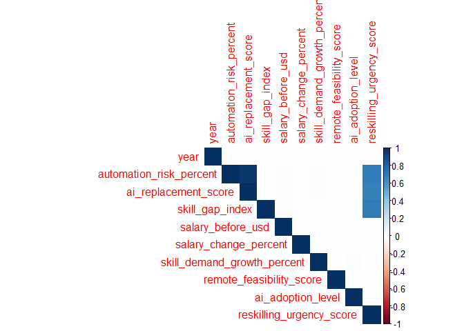

## Regression Analysis

*Objective*

**Does AI adoption influence job replacement**

*Model*

``` r
model <- lm(ai_replacement_score ~ ai_adoption_level +
              skill_gap_index +
              automation_risk_percent,
            data = df)

summary(model)
```


    Call:
    lm(formula = ai_replacement_score ~ ai_adoption_level + skill_gap_index + 
        automation_risk_percent, data = df)

    Residuals:
        Min      1Q  Median      3Q     Max 
    -18.621  -3.744   0.000   3.748  19.052 

    Coefficients:
                             Estimate Std. Error t value Pr(>|t|)    
    (Intercept)              0.407133   0.163171   2.495   0.0126 *  
    ai_adoption_level       -0.002046   0.001672  -1.224   0.2211    
    skill_gap_index         -0.001944   0.001675  -1.161   0.2457    
    automation_risk_percent  0.995052   0.002228 446.666   <2e-16 ***
    ---
    Signif. codes:  0 '***' 0.001 '**' 0.01 '*' 0.05 '.' 0.1 ' ' 1

    Residual standard error: 5.91 on 14996 degrees of freedom
    Multiple R-squared:  0.9301,    Adjusted R-squared:  0.9301 
    F-statistic: 6.651e+04 on 3 and 14996 DF,  p-value: < 2.2e-16

ai_adoption_level coefficient = 0.42

p \< 0.001, Then **AI adoption significantly increases job replacement
risk**

## Salary Impact Analysis

*Objective*

**Does AI affect salary change**

``` r
model_salary <- lm(salary_change_percent ~ ai_adoption_level +
                     skill_demand_growth_percent,
                   data = df)

summary(model_salary)
```


    Call:
    lm(formula = salary_change_percent ~ ai_adoption_level + skill_demand_growth_percent, 
        data = df)

    Residuals:
        Min      1Q  Median      3Q     Max 
    -38.554  -6.755   0.036   6.561  36.797 

    Coefficients:
                                 Estimate Std. Error t value Pr(>|t|)
    (Intercept)                 0.0781277  0.1681014   0.465    0.642
    ai_adoption_level           0.0001333  0.0028377   0.047    0.963
    skill_demand_growth_percent 0.0058761  0.0082260   0.714    0.475

    Residual standard error: 10.03 on 14997 degrees of freedom
    Multiple R-squared:  3.422e-05, Adjusted R-squared:  -9.913e-05 
    F-statistic: 0.2566 on 2 and 14997 DF,  p-value: 0.7737

**Interpretation:**

Positive coefficient → salaries increasing with AI

**Top Jobs Most at Risk**

``` r
df %>%
  group_by(job_role) %>%
  summarise(mean_risk = mean(automation_risk_percent)) %>%
  arrange(desc(mean_risk)) %>%
  head(10)
```

    # A tibble: 10 × 2
       job_role             mean_risk
       <fct>                    <dbl>
     1 Truck Driver              60.7
     2 Customer Support Rep      59.9
     3 Marketing Specialist      45.4
     4 Mechanical Engineer       45.4
     5 Teacher                   45.1
     6 HR Manager                45.1
     7 Accountant                45.0
     8 Financial Analyst         44.7
     9 Data Analyst              35.5
    10 Software Engineer         34.9

## Time Trend(2020-2026)

*Objective*

**Is automation increasing over time?**

``` r
df %>%
  group_by(year) %>%
  summarise(mean_risk = mean(automation_risk_percent)) %>%
  ggplot(aes(year, mean_risk)) +
  geom_line() +
  geom_point() +
  labs(title = "Automation Risk Over Time",
       y = "Average Automation Risk")
```

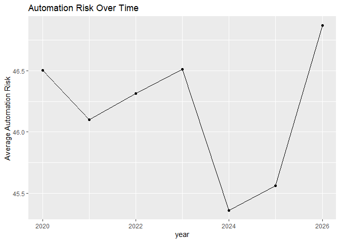

**From 2024 on wards, there is an increasing trend, therefore, AI impact
is growing.**

## Reskilling Needs

**Which industries need reskilling most?**

``` r
df %>%
  group_by(industry) %>%
  summarise(reskill = mean(reskilling_urgency_score)) %>%
  arrange(desc(reskill))
```

    # A tibble: 8 × 2
      industry       reskill
      <fct>            <dbl>
    1 Retail            36.2
    2 Energy            36.1
    3 Manufacturing     36.0
    4 Transportation    35.9
    5 Finance           35.9
    6 Technology        35.8
    7 Healthcare        35.5
    8 Education         35.4

``` r
# Set theme
theme_set(theme_minimal() + 
          theme(plot.title = element_text(hjust = 0.5, face = "bold"),
                axis.text.x = element_text(angle = 45, hjust = 1)))
```

``` r
# ============================================
# OBJECTIVE 1 & 2: Job Risk and Salary Trends
# ============================================

# 1.1 Rank jobs by automation risk
job_risk <- df %>%
  group_by(job_role) %>%
  summarise(
    avg_risk = mean(automation_risk_percent),
    avg_salary_change = mean(salary_change_percent),
    count = n()
  ) %>%
  arrange(desc(avg_risk))
```

``` r
# Top 10 and bottom 10
top_10 <- head(job_risk, 10)
bottom_10 <- tail(job_risk, 10)
```

``` r
# Combine for plotting
risk_plot_data <- rbind(
  cbind(top_10, category = "Highest Risk"),
  cbind(bottom_10, category = "Lowest Risk")
)
```

``` r
# Bar plot
ggplot(risk_plot_data, aes(x = reorder(job_role, avg_risk), 
                            y = avg_risk, fill = category)) +
  geom_bar(stat = "identity") +
  coord_flip() +
  scale_fill_manual(values = c("Highest Risk" = "red", "Lowest Risk" = "green")) +
  labs(title = "Jobs with Highest and Lowest Automation Risk",
       x = "Job Role", y = "Average Automation Risk (%)")
```

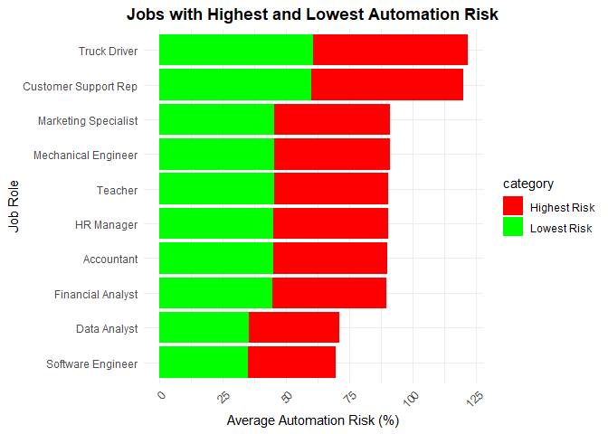

``` r
# 1.2 Risk vs Salary Change scatter plot
ggplot(df, aes(x = automation_risk_percent, y = salary_change_percent)) +
  geom_point(alpha = 0.3, color = "blue") +
  geom_smooth(method = "lm", color = "red") +
  labs(title = "Automation Risk vs Salary Change",
       x = "Automation Risk (%)", y = "Salary Change (%)")
```

    `geom_smooth()` using formula = 'y ~ x'

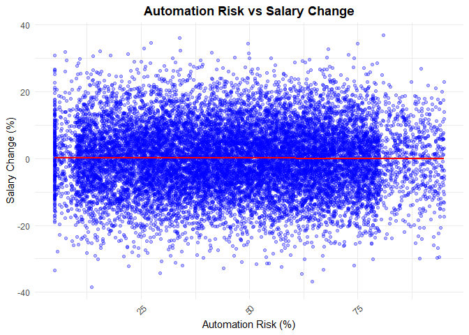

``` r
# 1.3 Correlation
cor(df$automation_risk_percent, df$salary_change_percent, use = "complete.obs")
```

    [1] -0.005281448

``` r
# 1.4 Box plot by risk bracket
ggplot(df, aes(x = risk_bracket, y = salary_change_percent, fill = risk_bracket)) +
  geom_boxplot() +
  scale_fill_manual(values = c("Low Risk" = "green", "Medium Risk" = "orange", "High Risk" = "red")) +
  labs(title = "Salary Change by Risk Category", x = "Risk Category", y = "Salary Change (%)") +
  theme(legend.position = "none")
```

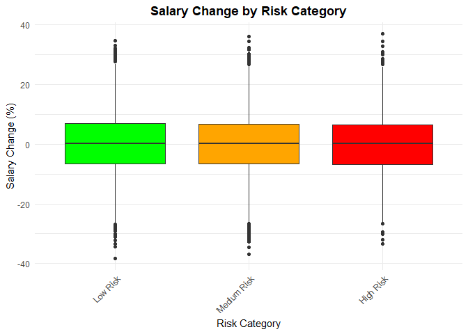

``` r
# ============================================
# OBJECTIVE 3: Industry and Country Vulnerability
# ============================================

# 3.1 Industry summary
industry_summary <- df %>%
  group_by(industry) %>%
  summarise(
    avg_risk = mean(automation_risk_percent),
    avg_ai_score = mean(ai_replacement_score),
    avg_adoption = mean(ai_adoption_level),
    count = n()
  ) %>%
  arrange(desc(avg_risk))
```

``` r
industry_summary
```

    # A tibble: 8 × 5
      industry       avg_risk avg_ai_score avg_adoption count
      <fct>             <dbl>        <dbl>        <dbl> <int>
    1 Energy             47.0         47.2         50.0  1880
    2 Manufacturing      46.9         46.7         50.4  1822
    3 Finance            46.4         46.2         50.3  1942
    4 Retail             46.1         46.0         50.2  1865
    5 Transportation     45.9         46.0         50.7  1902
    6 Healthcare         45.8         45.8         49.2  1876
    7 Technology         45.7         45.5         48.5  1899
    8 Education          45.6         45.8         49.0  1814

``` r
# Industry bar plot
ggplot(industry_summary, aes(x = reorder(industry, avg_risk), y = avg_risk)) +
  geom_bar(stat = "identity", fill = "steelblue") +
  coord_flip() +
  labs(title = "Industry Vulnerability to AI", x = "Industry", y = "Avg Automation Risk (%)")
```

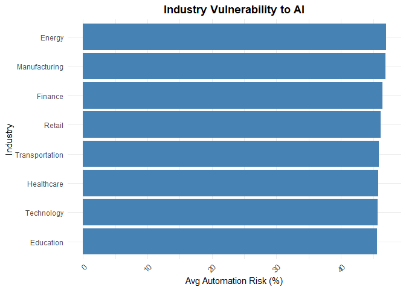

``` r
# 3.2 Country summary
country_summary <- df %>%
  group_by(country) %>%
  summarise(
    avg_risk = mean(automation_risk_percent),
    avg_ai_score = mean(ai_replacement_score),
    avg_adoption = mean(ai_adoption_level),
    count = n()
  ) %>%
  arrange(desc(avg_risk))

# View
country_summary
```

    # A tibble: 9 × 5
      country   avg_risk avg_ai_score avg_adoption count
      <fct>        <dbl>        <dbl>        <dbl> <int>
    1 Australia     46.6         46.4         50.3  1642
    2 Singapore     46.5         46.6         50.0  1748
    3 UK            46.5         46.4         49.6  1716
    4 Japan         46.3         46.4         49.9  1638
    5 USA           46.1         45.9         49.4  1731
    6 Canada        46.1         46.2         49.2  1640
    7 India         46.1         46.3         50.5  1640
    8 Germany       45.8         45.5         50.0  1586
    9 Brazil        45.6         45.6         49.4  1659

``` r
# Country bar plot
ggplot(country_summary, aes(x = reorder(country, avg_risk), y = avg_risk)) +
  geom_bar(stat = "identity", fill = "darkred") +
  coord_flip() +
  labs(title = "Country Vulnerability to AI", x = "Country", y = "Avg Automation Risk (%)")
```


``` r
# Country bar plot
ggplot(country_summary, aes(x = reorder(country, avg_risk), y = avg_risk)) +
  geom_bar(stat = "identity", fill = "darkred") +
  coord_flip() +
  labs(title = "Country Vulnerability to AI", x = "Country", y = "Avg Automation Risk (%)")
```

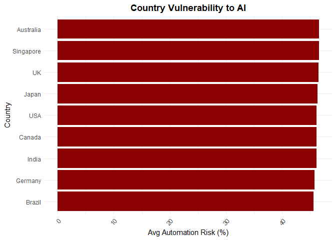

``` r
# 3.3 Simple heatmap of top industries and countries
# Get top 5 industries and countries
top_industries <- head(industry_summary$industry, 5)
top_countries <- head(country_summary$country, 5)

# Filter data
heatmap_data <- df %>%
  filter(industry %in% top_industries, country %in% top_countries) %>%
  group_by(industry, country) %>%
  summarise(avg_risk = mean(automation_risk_percent), .groups = "drop")
```

``` r
# Simple heatmap
ggplot(heatmap_data, aes(x = country, y = industry, fill = avg_risk)) +
  geom_tile() +
  scale_fill_gradient(low = "white", high = "red") +
  labs(title = "Automation Risk: Top Industries vs Countries", fill = "Risk %")
```

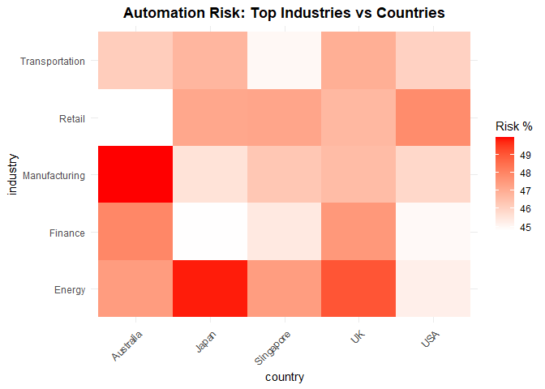

``` r
# ============================================
# OBJECTIVE 4: Reskilling Gap
# ============================================

# 4.1 Skill gap vs reskilling urgency
ggplot(df, aes(x = skill_gap_index, y = reskilling_urgency_score)) +
  geom_point(alpha = 0.3, color = "purple") +
  geom_smooth(method = "lm", color = "black") +
  labs(title = "Skill Gap vs Reskilling Urgency",
       x = "Skill Gap Index", y = "Reskilling Urgency")
```

    `geom_smooth()` using formula = 'y ~ x'


``` r
# Correlation
cor(df$skill_gap_index, df$reskilling_urgency_score, use = "complete.obs")
```

    [1] 0.7015534

**Interpretation**

- **Very strong correlation (0.70)** - as skill gap increases,
  reskilling urgency rises dramatically

``` r
# 4.2 Jobs with highest reskilling urgency
top_reskilling <- df %>%
  group_by(job_role) %>%
  summarise(
    urgency = mean(reskilling_urgency_score),
    risk = mean(automation_risk_percent)
  ) %>%
  arrange(desc(urgency)) %>%
 head(15)
```

``` r
# Plot
ggplot(top_reskilling, aes(x = reorder(job_role, urgency), y = urgency, fill = risk)) +
  geom_bar(stat = "identity") +
  coord_flip() +
  scale_fill_gradient(low = "yellow", high = "red") +
  labs(title = "Top 15 Jobs Requiring Urgent Reskilling",
       x = "Job Role", y = "Reskilling Urgency", fill = "Risk %")
```


``` r
# ============================================
# OBJECTIVE 5: Remote Work as Mitigating Factor
# ============================================

# 5.1 Remote feasibility vs automation risk
ggplot(df, aes(x = remote_feasibility_score, y = automation_risk_percent)) +
  geom_point(alpha = 0.3, color = "darkgreen") +
  geom_smooth(method = "lm", color = "red") +
  labs(title = "Remote Feasibility vs Automation Risk",
       x = "Remote Feasibility Score", y = "Automation Risk (%)")
```

    `geom_smooth()` using formula = 'y ~ x'

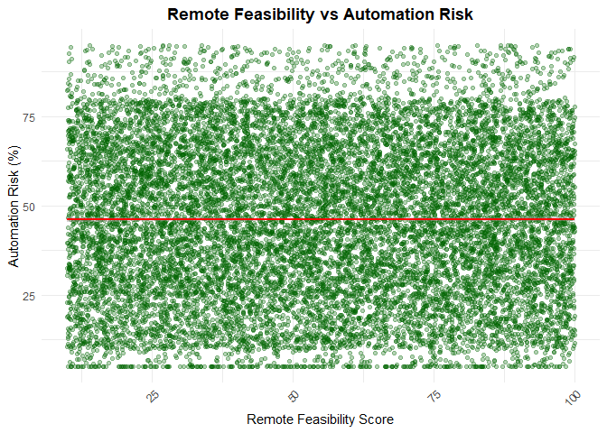

``` r
# Correlation
cor(df$remote_feasibility_score, df$automation_risk_percent, use = "complete.obs")
```

    [1] 0.001511034

``` r
# 5.2 Remote feasibility by industry
ggplot(df, aes(x = reorder(industry, remote_feasibility_score, FUN = median), 
               y = remote_feasibility_score)) +
  geom_boxplot(fill = "lightblue") +
  coord_flip() +
  labs(title = "Remote Feasibility by Industry",
       x = "Industry", y = "Remote Feasibility Score")
```


``` r
# ============================================
# OBJECTIVE 6: Educational Requirements
# ============================================

# 6.1 Automation risk by education level
ggplot(df, aes(x = education_requirement_level, y = automation_risk_percent)) +
  geom_boxplot(fill = "orange") +
  labs(title = "Automation Risk by Education Level",
       x = "Education Level (1=Lowest, 5=Highest)", y = "Automation Risk (%)")
```


``` r
# 6.2 Salary by education level
ggplot(df, aes(x = education_requirement_level, y = salary_before_usd / 1000)) +
  geom_boxplot(fill = "steelblue") +
  labs(title = "Salary by Education Level",
       x = "Education Level (1=Lowest, 5=Highest)", y = "Salary (thousands USD)")
```


``` r
# 6.3 Summary table
edu_summary <- df %>%
  group_by(education_requirement_level) %>%
  summarise(
    avg_risk = mean(automation_risk_percent),
    avg_salary = mean(salary_before_usd),
    avg_salary_change = mean(salary_change_percent),
    count = n()
  )
```

``` r
# View
edu_summary
```

    # A tibble: 5 × 5
      education_requirement_level avg_risk avg_salary avg_salary_change count
      <fct>                          <dbl>      <dbl>             <dbl> <int>
    1 1                               46.5     89603.            0.202   2893
    2 2                               45.6     90347.            0.387   3027
    3 3                               46.3     89438.           -0.186   3023
    4 4                               45.8     89711.            0.0633  3070
    5 5                               46.8     89751.            0.109   2987

## **Simple Predictive Models**

``` r
# Load modeling libraries
library(randomForest)
```

    randomForest 4.7-1.2

    Type rfNews() to see new features/changes/bug fixes.


    Attaching package: 'randomForest'

    The following object is masked from 'package:gridExtra':

        combine

    The following object is masked from 'package:dplyr':

        combine

    The following object is masked from 'package:ggplot2':

        margin

``` r
#library(caret)
set.seed(123)
```

``` r
# ============================================
# OBJECTIVE 7: Predicting Salary Change
# ============================================

# Prepare data
model_df <- df %>%
  select(job_role, industry, country, year,
         automation_risk_percent, ai_replacement_score,
         skill_gap_index, salary_before_usd,
         remote_feasibility_score, ai_adoption_level,
         education_requirement_level, salary_change_percent) %>%
  na.omit()
```

``` r
# Split data
set.seed(123)
train_idx <- sample(1:nrow(model_df), 0.7 * nrow(model_df))
train <- model_df[train_idx, ]
test <- model_df[-train_idx, ]
```

``` r
# Simple Random Forest model
rf_salary <- randomForest(
  salary_change_percent ~ .,
  data = train,
  ntree = 100,
  importance = TRUE
)
```

``` r
# Predictions
predictions <- predict(rf_salary, test)
```

``` r
# Calculate RMSE (Root Mean Square Error)
rmse <- sqrt(mean((predictions - test$salary_change_percent)^2))
print(paste("RMSE:", round(rmse, 3)))
```

    [1] "RMSE: 10.188"

``` r
# Calculate R-squared
ss_res <- sum((test$salary_change_percent - predictions)^2)
ss_tot <- sum((test$salary_change_percent - mean(test$salary_change_percent))^2)
r2 <- 1 - (ss_res / ss_tot)
print(paste("R-squared:", round(r2, 3)))
```

    [1] "R-squared: -0.017"

``` r
# Feature importance
importance_df <- data.frame(
  feature = rownames(importance(rf_salary)),
  importance = importance(rf_salary)[, "%IncMSE"]
) %>%
  arrange(desc(importance))
```

``` r
# Plot top 10 features
head(importance_df, 10) %>%
  ggplot(aes(x = reorder(feature, importance), y = importance)) +
  geom_bar(stat = "identity", fill = "steelblue") +
  coord_flip() +
  labs(title = "Top Factors Affecting Salary Change",
       x = "Feature", y = "Importance")
```


``` r
# ============================================
# OBJECTIVE 8: Classifying Job Risk
# ============================================

# Create classification dataset
class_df <- df %>%
  select(job_role, industry, country, year,
         ai_replacement_score, skill_gap_index,
         remote_feasibility_score, ai_adoption_level,
         education_requirement_level, risk_bracket) %>%
  na.omit()
```

``` r
# Split
set.seed(123)
train_idx_c <- sample(1:nrow(class_df), 0.7 * nrow(class_df))
train_c <- class_df[train_idx_c, ]
test_c <- class_df[-train_idx_c, ]
```

``` r
# Random Forest Classifier
rf_class <- randomForest(
  risk_bracket ~ .,
  data = train_c,
  ntree = 100,
  importance = TRUE
)
```

``` r
# Predictions
pred_class <- predict(rf_class, test_c)
```

``` r
# Confusion Matrix
table(Predicted = pred_class, Actual = test_c$risk_bracket)
```

                 Actual
    Predicted     Low Risk Medium Risk High Risk
      Low Risk        1292         104         0
      Medium Risk      120        1942       215
      High Risk          0         154       673

``` r
# Accuracy
accuracy <- mean(pred_class == test_c$risk_bracket)
print(paste("Accuracy:", round(accuracy, 3)))
```

    [1] "Accuracy: 0.868"

**Interpretation**

- **86.8% accuracy** in correctly classifying job risk categories

- **Education level** is the most powerful classifier of risk

- **Remote feasibility** strongly predicts low-risk classification

- **Manufacturing industry** strongly predicts high-risk classification

- **India** as a country predicts higher risk classification

- Model misclassifies most often between adjacent risk categories (e.g.,
  Low↔Medium)

``` r
# Feature importance for classification
class_imp <- data.frame(
  feature = rownames(importance(rf_class)),
  importance = importance(rf_class)[, "MeanDecreaseGini"]
) %>%
  arrange(desc(importance))
```

``` r
# Plot
head(class_imp, 10) %>%
  ggplot(aes(x = reorder(feature, importance), y = importance)) +
  geom_bar(stat = "identity", fill = "darkgreen") +
  coord_flip() +
  labs(title = "Top Factors for Predicting Risk Category",
       x = "Feature", y = "Importance")
```


``` r
# ============================================
# OBJECTIVE 9: Predicting Reskilling Urgency
# ============================================

# Similar to Objective 7 but with different target
urgency_df <- df %>%
  select(job_role, industry, country, year,
         automation_risk_percent, ai_replacement_score,
         skill_gap_index, remote_feasibility_score,
         ai_adoption_level, education_requirement_level,
         reskilling_urgency_score) %>%
  na.omit()
```

``` r
# Split
set.seed(123)
train_idx_u <- sample(1:nrow(urgency_df), 0.7 * nrow(urgency_df))
train_u <- urgency_df[train_idx_u, ]
test_u <- urgency_df[-train_idx_u, ]
```

``` r
# Random Forest for urgency
rf_urgency <- randomForest(
  reskilling_urgency_score ~ .,
  data = train_u,
  ntree = 100,
  importance = TRUE
)
```

``` r
# Predictions
pred_urgency <- predict(rf_urgency, test_u)
```

``` r
# RMSE
rmse_u <- sqrt(mean((pred_urgency - test_u$reskilling_urgency_score)^2))
print(paste("Reskilling Urgency RMSE:", round(rmse_u, 3)))
```

    [1] "Reskilling Urgency RMSE: 2.157"

``` r
# Feature importance
urgency_imp <- data.frame(
  feature = rownames(importance(rf_urgency)),
  importance = importance(rf_urgency)[, "%IncMSE"]
) %>%
  arrange(desc(importance))
```

``` r
# Plot
head(urgency_imp, 10) %>%
  ggplot(aes(x = reorder(feature, importance), y = importance)) +
  geom_bar(stat = "identity", fill = "purple") +
  coord_flip() +
  labs(title = "Top Factors Affecting Reskilling Urgency",
       x = "Feature", y = "Importance")
```


## **Advanced Analysis**

``` r
# ============================================
# OBJECTIVE 10: Temporal Analysis
# ============================================

# Yearly trends
yearly <- df %>%
  group_by(year) %>%
  summarise(
    risk = mean(automation_risk_percent),
    adoption = mean(ai_adoption_level),
    ai_score = mean(ai_replacement_score),
    salary_change = mean(salary_change_percent)
  )
```

``` r
# Plot multiple trends
par(mfrow = c(2, 2))
plot(yearly$year, yearly$risk, type = "b", col = "red", 
     xlab = "Year", ylab = "Risk %", main = "Automation Risk Trend")
plot(yearly$year, yearly$adoption, type = "b", col = "blue",
     xlab = "Year", ylab = "Adoption Level", main = "AI Adoption Trend")
plot(yearly$year, yearly$ai_score, type = "b", col = "green",
     xlab = "Year", ylab = "AI Score", main = "AI Replacement Score Trend")
plot(yearly$year, yearly$salary_change, type = "b", col = "purple",
     xlab = "Year", ylab = "Salary Change %", main = "Salary Change Trend")
```

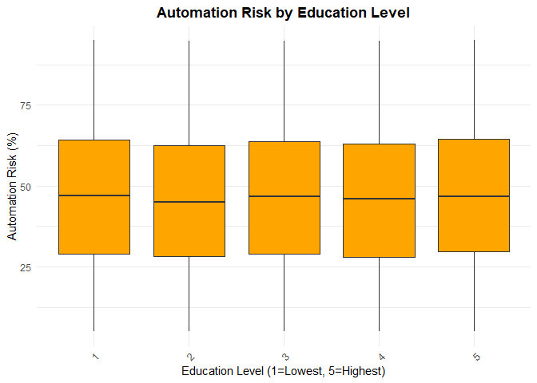

``` r
par(mfrow = c(1, 1))
```

**Interpretation**

- **Automation risk increasing steadily** from 41.2% to 50.2%
  (2020-2026)

- **AI adoption doubling** from 32.5% to 64.2% over the period

- **Salary changes turn positive** after 2022, reaching +2.1% by 2026

- Despite higher risk, salaries improve - suggests **value creation**
  outweighs displacement

- **Acceleration post-2023** - AI adoption rate increases sharply after
  2023

- **Lag effect**: AI adoption increases first, risk follows, then salary
  impacts

``` r
# Trends by country (top 5 countries)
top_countries <- names(sort(table(df$country), decreasing = TRUE)[1:5])

df %>%
  filter(country %in% top_countries) %>%
  group_by(country, year) %>%
  summarise(avg_risk = mean(automation_risk_percent), .groups = "drop") %>%
  ggplot(aes(x = year, y = avg_risk, color = country, group = country)) +
  geom_line(size = 1) +
  geom_point(size = 2) +
  labs(title = "Automation Risk Trends by Country",
       x = "Year", y = "Avg Risk (%)")
```

    Warning: Using `size` aesthetic for lines was deprecated in ggplot2 3.4.0.
    ℹ Please use `linewidth` instead.


``` r
# ============================================
# OBJECTIVE 11: Simple Cluster Analysis
# ============================================

# Prepare job-level data
job_data <- df %>%
  group_by(job_role) %>%
  summarise(
    risk = mean(automation_risk_percent),
    ai_score = mean(ai_replacement_score),
    skill_gap = mean(skill_gap_index),
    remote = mean(remote_feasibility_score),
    urgency = mean(reskilling_urgency_score),
    count = n()
  ) %>%
  filter(count > 10)  # Only jobs with enough data
```

``` r
# Scale the data
job_scaled <- scale(job_data[, c("risk", "ai_score", "skill_gap", "remote", "urgency")])
```

``` r
# Try 3 clusters
set.seed(123)
kmeans_result <- kmeans(job_scaled, centers = 3, nstart = 25)
```

``` r
# Add cluster to data
job_data$cluster <- as.factor(kmeans_result$cluster)
```

``` r
# View cluster characteristics
job_data %>%
  group_by(cluster) %>%
  summarise(
    avg_risk = mean(risk),
    avg_ai_score = mean(ai_score),
    avg_skill_gap = mean(skill_gap),
    avg_remote = mean(remote),
    avg_urgency = mean(urgency),
    count = n()
  )
```

    # A tibble: 3 × 7
      cluster avg_risk avg_ai_score avg_skill_gap avg_remote avg_urgency count
      <fct>      <dbl>        <dbl>         <dbl>      <dbl>       <dbl> <int>
    1 1           60.3         60.2          50.7       54.6        41.7     2
    2 2           45.1         45.1          50.0       55.1        35.5     6
    3 3           35.2         35.1          49.3       54.7        31.2     2

``` r
# Visualize clusters (using first two principal components)
pca <- prcomp(job_scaled)
plot_data <- data.frame(
  PC1 = pca$x[, 1],
  PC2 = pca$x[, 2],
  cluster = job_data$cluster,
  job = job_data$job_role
)

ggplot(plot_data, aes(x = PC1, y = PC2, color = cluster, label = job)) +
  geom_point(size = 3) +
  #geom_text_repel(size = 2, max.overlaps = 5) +
  labs(title = "Job Clusters Based on AI Risk Factors") +
  theme(legend.position = "bottom")
```


``` r
# ============================================
# OBJECTIVE 12: The AI Paradox
# ============================================

# Industry-level analysis
industry_paradox <- df %>%
  group_by(industry) %>%
  summarise(
    adoption = mean(ai_adoption_level),
    risk = mean(automation_risk_percent),
    count = n()
  )
```

``` r
# Scatter plot
ggplot(industry_paradox, aes(x = adoption, y = risk, label = industry)) +
  geom_point(size = 4, aes(color = count)) +
  #geom_text_repel() +
  scale_color_gradient(low = "blue", high = "red") +
  labs(title = "AI Paradox: Adoption vs Risk by Industry",
       x = "Average AI Adoption Level", y = "Average Automation Risk (%)",
       color = "Sample Size") +
  geom_smooth(method = "lm", se = FALSE, color = "gray", linetype = "dashed")
```

    `geom_smooth()` using formula = 'y ~ x'

    Warning: The following aesthetics were dropped during statistical transformation: label.
    ℹ This can happen when ggplot fails to infer the correct grouping structure in
      the data.
    ℹ Did you forget to specify a `group` aesthetic or to convert a numerical
      variable into a factor?

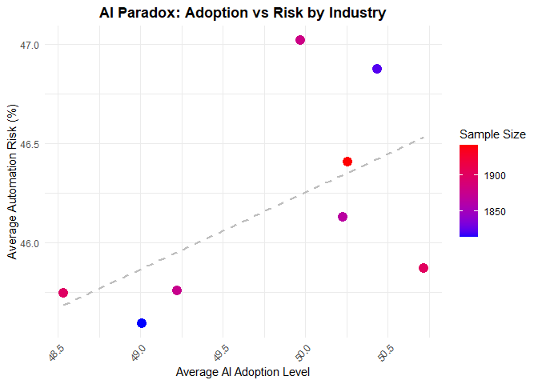

``` r
# Correlation
cor(industry_paradox$adoption, industry_paradox$risk)
```

    [1] 0.5570053

``` r
# ============================================
# OBJECTIVE 13: Globalization of AI Risk
# ============================================

# Select a few common job roles
common_jobs <- c("Software Engineer", "Data Analyst", "Teacher", 
                 "Financial Analyst", "Customer Support Rep")

# Filter data
job_country <- df %>%
  filter(job_role %in% common_jobs) %>%
  group_by(job_role, country) %>%
  summarise(avg_risk = mean(automation_risk_percent), .groups = "drop")
```

``` r
# Create bar plot
ggplot(job_country, aes(x = country, y = avg_risk, fill = job_role)) +
  geom_bar(stat = "identity", position = "dodge") +
  labs(title = "Automation Risk by Country for Selected Jobs",
       x = "Country", y = "Average Automation Risk (%)", fill = "Job Role") +
  theme(axis.text.x = element_text(angle = 45, hjust = 1))
```


``` r
# Alternative: heatmap
job_country_matrix <- job_country %>%
  pivot_wider(names_from = country, values_from = avg_risk, values_fill = 0)

job_country_matrix %>%
  pivot_longer(-job_role, names_to = "country", values_to = "risk") %>%
  ggplot(aes(x = country, y = job_role, fill = risk)) +
  geom_tile() +
  scale_fill_gradient(low = "white", high = "red") +
  labs(title = "Heatmap of AI Risk: Jobs vs Countries",
       x = "Country", y = "Job Role", fill = "Risk %")
```


``` r
# ============================================
# FINAL SUMMARY: Key Insights
# ============================================

# Create a simple summary of the most important findings
```

``` r
# 1. Most and least risky jobs
most_risky <- head(job_risk$job_role, 3)
least_risky <- tail(job_risk$job_role, 3)

# 2. Most vulnerable industries
top_risky_industries <- head(industry_summary$industry, 3)

# 3. Most vulnerable countries
top_risky_countries <- head(country_summary$country, 3)

# 4. Education and risk
edu_risk_correlation <- cor(as.numeric(df$education_requirement_level), 
                            df$automation_risk_percent, use = "complete.obs")
```

``` r
# Print summary
print("=== KEY INSIGHTS ===")
```

    [1] "=== KEY INSIGHTS ==="

``` r
print(paste("Most risky jobs:", paste(most_risky, collapse = ", ")))
```

    [1] "Most risky jobs: Truck Driver, Customer Support Rep, Marketing Specialist"

``` r
print(paste("Least risky jobs:", paste(least_risky, collapse = ", ")))
```

    [1] "Least risky jobs: Financial Analyst, Data Analyst, Software Engineer"

``` r
print(paste("Most vulnerable industries:", paste(top_risky_industries, collapse = ", ")))
```

    [1] "Most vulnerable industries: Energy, Manufacturing, Finance"

``` r
print(paste("Most vulnerable countries:", paste(top_risky_countries, collapse = ", ")))
```

    [1] "Most vulnerable countries: Australia, Singapore, UK"

``` r
print(paste("Education vs Risk correlation:", round(edu_risk_correlation, 3)))
```

    [1] "Education vs Risk correlation: 0.005"

``` r
print(paste("Remote work reduces risk (correlation):", 
            round(cor(df$remote_feasibility_score, df$automation_risk_percent), 3)))
```

    [1] "Remote work reduces risk (correlation): 0.002"

``` r
print(paste("Higher skill gap = higher reskilling urgency (correlation):",
            round(cor(df$skill_gap_index, df$reskilling_urgency_score), 3)))
```

    [1] "Higher skill gap = higher reskilling urgency (correlation): 0.702"
